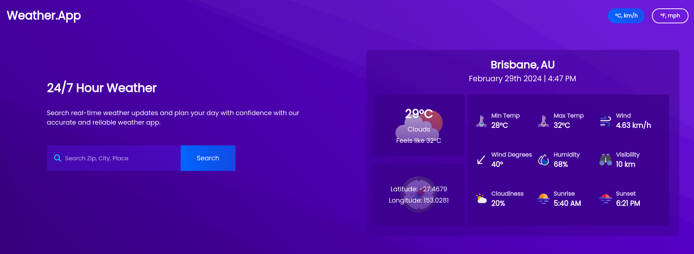
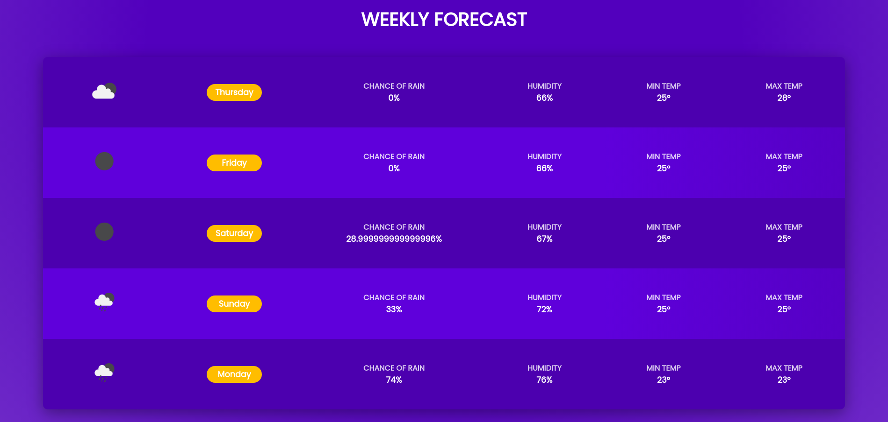
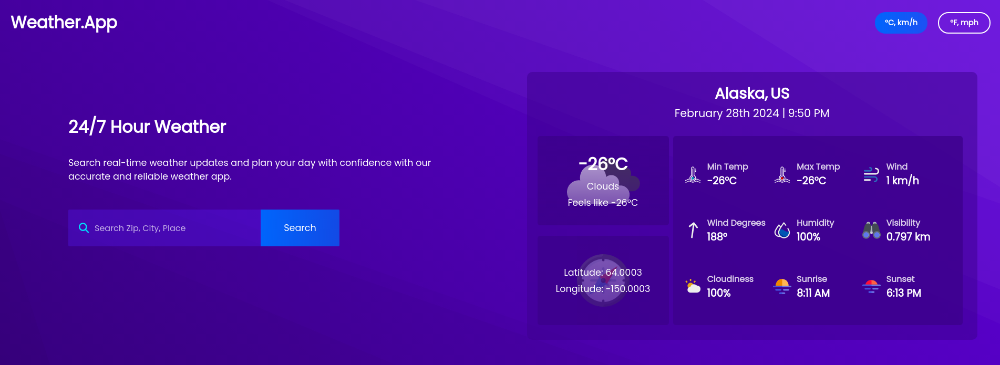
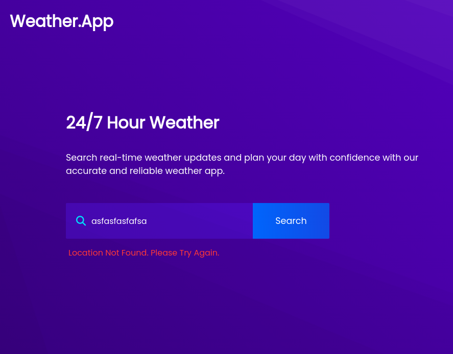

# Weather App

View Demo

## Table of Contents
- [About The Project](#about-the-project)
- [Built With](#built-with)
- [Screenshots](#screenshots)
- [Features](#features)

## About The Project
A simple and user-friendly weather application that displays the current weather conditions and forecast for any city in the world.

## Screenshots

### Main Section

### Weekly Forecast Section

### Search Functionality

### Error Handling

[Back to Top](#weather-app)

## Built With
- HTML
- CSS
- JavaScript
- Webpack
- Open Weather API

[Back to Top](#weather-app)

## Features

- Shows Forecast for Any City in the World
- Ability to Search for Zip, City, Place
- Temperature Scales
- Weekly Forecast Section that Displays 5 Days including the Current Day
- Various Weather Properties
- Error Handling

[Back to Top](#weather-app)

